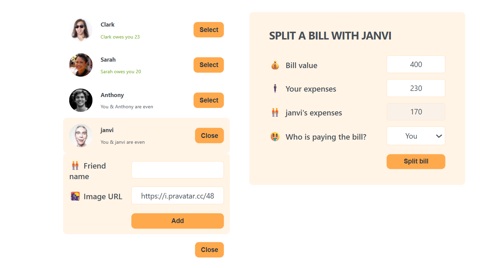

# 💸 Eat & Split Bills

A clean and simple React app to **split bills** between friends. Easily track who paid, who owes whom, and settle up smartly!

> 🔗 [Live Demo on Netlify](https://eatandsplitbills.netlify.app/)

---

## 📸 Screenshot

 

---

## ✨ Features

- Add friends with balance tracking
- Select who paid and split amounts
- Clear debts between friends
- Smooth and responsive UI

---

## 🛠️ Tech Stack

- ⚛️ React
- ⚡ Vite
- 🎨 Tailwind CSS

---

## 🚀 Getting Started

1. Clone the repository:
   ```bash
   git clone https://github.com/yourusername/split-bill.git
   cd split-bill
